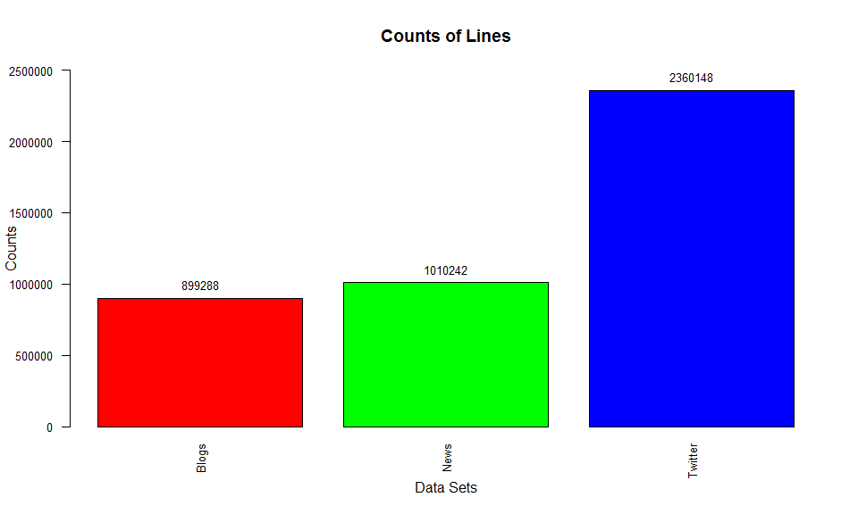
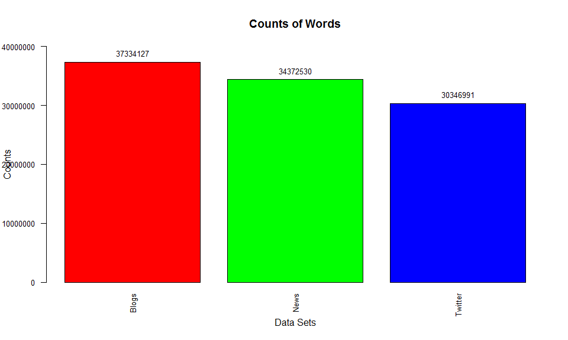
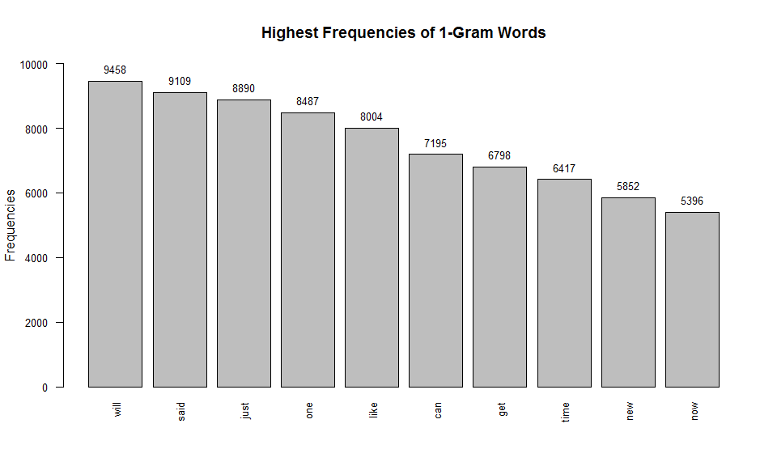
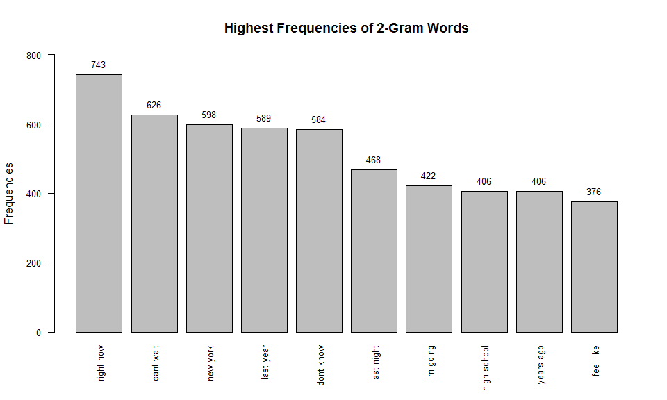
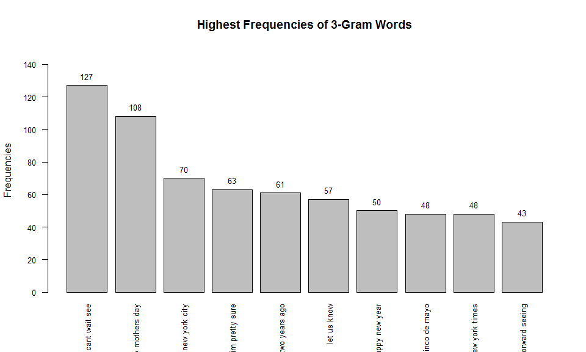

# Data Science Capstone: Milestone Report
Author: Poo, L. S.  
Date: `r format(Sys.Date(), '%d %B %Y')`  

## Overview

In this capstone, I will work on understanding and building predictive text models like those used by SwiftKey. This capstone will start with analyzing a large corpus of text documents to discover the structure in the data and how words are put together. It will cover cleaning and analyzing text data, then building and sampling from a predictive text model. Finally, I will build a predictive text product which is a Shiny app.

The following link is the training data to be downloaded. It will be the basis for most of the capstone. My original exploration of the data and modeling steps will be performed on this data set.

[https://d396qusza40orc.cloudfront.net/dsscapstone/dataset/Coursera-SwiftKey.zip](https://d396qusza40orc.cloudfront.net/dsscapstone/dataset/Coursera-SwiftKey.zip)

This capstone uses the files named LOCALE.blogs.txt, LOCALE.news.txt, and LOCALE.twitter.txt where LOCALE is each of the four locales en\_US, de\_DE, ru\_RU, and fi\_FI. The data is from a corpus called HC Corpora. I will use the English database in this exercise.

## Loading Data Sets

The *tokenizers* and *tm* packages are loaded for text mining and analysis purposes. We need to set the seed. This is to improve the reproducibility of the analysis.


```r
library(tokenizers)
library(tm)
set.seed(12345)
```

The training data sets are loaded into R.


```r
mycon <- file("~/DataScienceCapstone/en_US/en_US.blogs.txt", open = "r")
vec_blogs <- readLines(mycon, encoding = "UTF-8", skipNul = TRUE)
close(mycon)

mycon <- file("~/DataScienceCapstone/en_US/en_US.news.txt", open = "rb")
vec_news <- readLines(mycon, encoding = "UTF-8", skipNul = TRUE)
close(mycon)

mycon <- file("~/DataScienceCapstone/en_US/en_US.twitter.txt", open = "r")
vec_twitter <- readLines(mycon, encoding = "UTF-8", skipNul = TRUE)
close(mycon)
```

The counts of lines and words for each of the data files are calculated and plotted.


```r
counts_lines <- c(length(vec_blogs), length(vec_news), length(vec_twitter))
counts_words <- c(sum(nchar(vec_blogs) - nchar(gsub(" ", "", vec_blogs)) + 1),
                  sum(nchar(vec_news) - nchar(gsub(" ", "", vec_news)) + 1),
                  sum(nchar(vec_twitter) - nchar(gsub(" ", "", vec_twitter)) + 1))
df_counts <- data.frame(lines = counts_lines, words = counts_words)

options(scipen = 999) ## To disable scientific/exponential notation
par(las = 2) ## The style of axis labels set to always perpendicular to the axis

plot_lines <- barplot(df_counts$lines,
                      names.arg = c("Blogs", "News", "Twitter"),
                      col = rainbow(3),
                      main = "Counts of Lines",
                      xlab = "Data Sets",
                      ylab = "Counts",
                      ylim = c(0, 2500000),
                      cex.axis = 0.8,
                      cex.names = 0.8)
text(plot_lines,
     df_counts$lines,
     labels = df_counts$lines,
     pos = 3,
     cex = 0.8)
```

<!-- -->

```r
plot_words <- barplot(df_counts$words,
                      names.arg = c("Blogs", "News", "Twitter"),
                      col = rainbow(3),
                      main = "Counts of Words",
                      xlab = "Data Sets",
                      ylab = "Counts",
                      ylim = c(0, 40000000),
                      cex.axis = 0.8,
                      cex.names = 0.8)
text(plot_words,
     df_counts$words,
     labels = df_counts$words,
     pos = 3,
     cex = 0.8)
```

<!-- -->

## Cleaning the Data

Due to the extremely large original data sets and limited computing resources, only 3% of text lines in each of the files will be sampled out for further analysis. The three sampled data sets are merged and combined into a single data set. All non-ASCII characters are removed from the sampled data.


```r
vec_all <- c(sample(vec_blogs, length(vec_blogs) * 0.03),
             sample(vec_news, length(vec_news) * 0.03),
             sample(vec_twitter, length(vec_twitter) * 0.03))
vec_all <- iconv(vec_all, to = "ASCII", sub = "")
```

The data set will then be made into corpus before further data cleaning can be done.


```r
mycorpus <- Corpus(VectorSource(vec_all))
```

The text will be converted to lower case. All numbers, punctuations, and common stopwords will also be removed from the data as they are not needed in prediction. Note that the data contain words of offensive and profane meaning. Profanity filtering is needed in removing profanity and other words that do not need to be predicted. The profanity list is obtained from here: [https://gist.github.com/jamiew/1112488](https://gist.github.com/jamiew/1112488). Extra white spaces will be eliminated from the text as well.


```r
mycorpus <- tm_map(mycorpus, tolower)
mycorpus <- tm_map(mycorpus, removeNumbers)
mycorpus <- tm_map(mycorpus, removePunctuation)
mycorpus <- tm_map(mycorpus, removeWords, stopwords("en"))
mycon <- file("~/DataScienceCapstone/en_US/profanity.txt", open = "r")
vec_profanity <- readLines(mycon, encoding = "UTF-8", skipNul = TRUE)
close(mycon)
mycorpus <- tm_map(mycorpus, removeWords, vec_profanity)
mycorpus <- tm_map(mycorpus, stripWhitespace)
mycorpus <- tm_map(mycorpus, PlainTextDocument)
```

## Exploratory Data Analysis

The first step in building a predictive model for text is understanding the distribution and relationship between the words, tokens, and phrases in the text. The goal of this exploratory analysis is to understand the basic relationships observed in the data and prepare to build the text predictive model. Tokenizers for 1-gram, 2-gram, and 3-gram are created to tokenize the text.


```r
tokenizer_1gram <- function(x) {
    unlist(tokenize_ngrams(as.character(x), n = 1))
}
tokenizer_2gram <- function(x) {
    unlist(tokenize_ngrams(as.character(x), n = 2))
}
tokenizer_3gram <- function(x) {
    unlist(tokenize_ngrams(as.character(x), n = 3))
}
```

Frequencies of words in 1-gram, 2-gram, and 3-gram tokens will be calculated and plotted.


```r
freq_1gram <- termFreq(mycorpus[[1]], control = list(tokenize = tokenizer_1gram))
freq_2gram <- termFreq(mycorpus[[1]], control = list(tokenize = tokenizer_2gram))
freq_3gram <- termFreq(mycorpus[[1]], control = list(tokenize = tokenizer_3gram))

options(scipen = 999) ## To disable scientific/exponential notation
par(las = 2) ## The style of axis labels set to always perpendicular to the axis

plot_1gram <- barplot(sort(freq_1gram, decreasing = TRUE)[1:10],
                      col = "grey",
                      main = "Highest Frequencies of 1-Gram Words",
                      ylab = "Frequencies",
                      ylim = c(0, 10000),
                      cex.axis = 0.8,
                      cex.names = 0.8)
text(plot_1gram,
     sort(freq_1gram, decreasing = TRUE)[1:10],
     labels = sort(freq_1gram, decreasing = TRUE)[1:10],
     pos = 3,
     cex = 0.8)
```

<!-- -->

```r
sort(freq_1gram, decreasing = TRUE)[1:10]
```

```

will said just  one like  can  get time  new  now 
9458 9109 8890 8487 8004 7195 6798 6417 5852 5396 
```

```r
plot_2gram <- barplot(sort(freq_2gram, decreasing = TRUE)[1:10],
                      col = "grey",
                      main = "Highest Frequencies of 2-Gram Words",
                      ylab = "Frequencies",
                      ylim = c(0, 800),
                      cex.axis = 0.8,
                      cex.names = 0.8)
text(plot_2gram,
     sort(freq_2gram, decreasing = TRUE)[1:10],
     labels = sort(freq_2gram, decreasing = TRUE)[1:10],
     pos = 3,
     cex = 0.8)
```

<!-- -->

```r
sort(freq_2gram, decreasing = TRUE)[1:10]
```

```

  right now   cant wait    new york   last year   dont know  last night 
        743         626         598         589         584         468 
   im going high school   years ago   feel like 
        422         406         406         376 
```

```r
plot_3gram <- barplot(sort(freq_3gram, decreasing = TRUE)[1:10],
                      col = "grey",
                      main = "Highest Frequencies of 3-Gram Words",
                      ylab = "Frequencies",
                      ylim = c(0, 150),
                      cex.axis = 0.8,
                      cex.names = 0.8)
text(plot_3gram,
     sort(freq_3gram, decreasing = TRUE)[1:10],
     labels = sort(freq_3gram, decreasing = TRUE)[1:10],
     pos = 3,
     cex = 0.8)
```

<!-- -->

```r
sort(freq_3gram, decreasing = TRUE)[1:10]
```

```

         cant wait see      happy mothers day          new york city 
                   127                    108                     70 
        im pretty sure          two years ago            let us know 
                    63                     61                     57 
        happy new year          cinco de mayo         new york times 
                    50                     48                     48 
looking forward seeing 
                    43 
```

## Plans on Predictive Modeling

The goal here is to build a simple model for the relationship between words. This is the first step in building a predictive text mining application. Using the exploratory analysis performed, a basic n-gram model will be built for predicting the next word based on the previous 1, 2, or 3 words. In some cases, people will want to type a combination of words that does not appear in the corpora or not observed. A model to handle unseen n-grams will be built. If needed, further data cleaning will be done to improve the prediction accuracy. The finalized predictive model will be used to develop the Shiny app.
